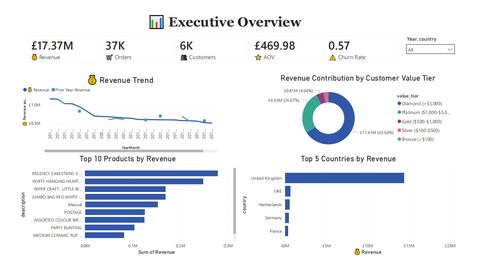
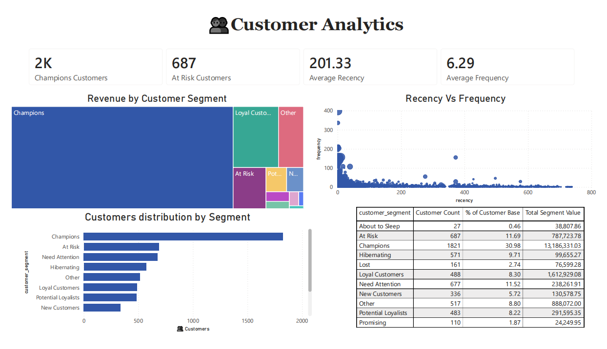

# 🎯 Customer Intelligence — Analyse du comportement client et modélisation prédictive

**Projet personnel · Data Analytics · Machine Learning · Business Intelligence**

[🇬🇧 English](README_EN.md)

## Présentation

Ce projet explore les données transactionnelles historiques **Online Retail II (2009–2011)** pour analyser les ventes, segmenter les clients, estimer le risque d'attrition et prévoir leur valeur future. Il combine préparation des données avec Python, analyses RFM, modèles de machine learning, modélisation de la valeur vie client et visualisation dans Power BI.

> Projet de portfolio réalisé sur des données historiques : les prévisions ne sont pas des revenus réalisés et l'expérimentation marketing est entièrement simulée. Le dépôt ne constitue pas une application déployée en production.

### Chiffres clés

| Indicateur | Résultat |
|---|---:|
| Lignes transactionnelles initiales | 1 067 371 |
| Lignes conservées après nettoyage | 779 425 |
| Clients uniques | 5 878 |
| Produits distincts | 4 631 |
| Pays représentés | 41 |
| Chiffre d'affaires historique calculé | 17 374 804,27 £ |
| Segments RFM | 11 |
| Modèles de classification comparés | 4 |
| Clients inclus dans la modélisation du churn | 5 281 |
| Clients avec prévision de CLV | 3 626 |


## Tableau de bord Power BI

Le projet comprend un tableau de bord interactif présentant les indicateurs commerciaux, la segmentation, les risques clients et les prévisions. Les captures ci-dessous correspondent aux chemins documentés dans le dépôt.





[Ouvrir le fichier Power BI](powerbi/Customer%20Intelligence%20Dashboard.pbix)

Les huit pages décrites dans le projet portent sur la vue exécutive, la segmentation, le churn, la CLV, les tendances temporelles, les produits, la géographie et l'analyse marketing simulée.

## Technologies

| Domaine | Outils |
|---|---|
| Préparation et analyse | Python, Pandas, NumPy |
| Machine learning | scikit-learn, XGBoost, imbalanced-learn |
| CLV | Lifetimes : BG/NBD et Gamma-Gamma |
| Statistiques | SciPy, Statsmodels |
| Stockage et requêtes | MySQL |
| Visualisation | Power BI, Matplotlib, Seaborn |
| Environnement | Jupyter Notebook, Git, GitHub |

## Méthodologie et résultats

### 1. Préparation des données

**Notebook :** [`01_data_cleaning.ipynb`](notebooks/01_data_cleaning.ipynb)

Les deux feuilles du fichier `online_retail_II.xlsx` sont réunies, puis les noms de colonnes sont harmonisés. Le nettoyage traite les doublons, les valeurs manquantes, les commandes annulées et les quantités ou prix non positifs. Des variables temporelles et un montant de ligne (`quantity × price`) sont calculés.

**Sortie :** 779 425 lignes, 19 colonnes, 5 878 clients et 4 631 produits distincts. Le chiffre d'affaires historique calculé sur les lignes retenues est de **17 374 804,27 £**.

### 2. Segmentation RFM

**Notebook :** [`02_rfm_analysis.ipynb`](notebooks/02_rfm_analysis.ipynb)

La segmentation s'appuie sur la **récence** du dernier achat, la **fréquence** des commandes et le **montant** des achats. Des scores RFM répartissent les 5 878 clients en **11 segments**.

| Segment | Clients | Part des clients |
|---|---:|---:|
| Champions | 1 821 | 30,98 % |
| At Risk | 687 | 11,69 % |
| Need Attention | 677 | 11,52 % |
| Hibernating | 571 | 9,71 % |
| Other | 517 | 8,80 % |
| Loyal Customers | 488 | 8,30 % |
| Potential Loyalists | 483 | 8,22 % |
| New Customers | 336 | 5,72 % |
| Lost | 161 | 2,74 % |
| Promising | 110 | 1,87 % |
| About to Sleep | 27 | 0,46 % |

Les **Champions** génèrent **13 186 331,03 £**, soit **75,89 %** du chiffre d'affaires historique. Le segment **At Risk** regroupe 687 clients ayant précédemment généré **787 723,78 £** : ce montant est historique et ne représente pas une perte future certaine.

### 3. Prédiction du churn

**Notebook :** [`03_churn_prediction.ipynb`](notebooks/03_churn_prediction.ipynb)

**Définition opérationnelle :** un client est étiqueté « churn » lorsqu'aucun achat n'est enregistré pendant les 90 derniers jours du jeu de données.

- Fin des données : **9 décembre 2011**.
- Fin de la période d'observation des variables : **10 septembre 2011**.
- Fenêtre utilisée pour l'étiquette : **90 jours**.
- Transactions antérieures à la date de coupure utilisées pour construire les variables : **620 572**.
- Clients présents dans le jeu de modélisation : **5 281**, avec **25 variables**.
- Répartition entraînement/test : **4 224 / 1 057 clients**, triés selon la date de leur premier achat.
- Standardisation ajustée sur l'entraînement et SMOTE appliqué uniquement à l'entraînement.

**Deux taux distincts :** le taux calculé sur l'ensemble des **5 878 clients** est de **50,85 %** ; celui du sous-ensemble de **5 281 clients** utilisé pour la modélisation est de **56,60 %**.

#### Comparaison des modèles sur le jeu de test

| Modèle | ROC-AUC | F1 au seuil de 0,5 |
|---|---:|---:|
| Régression logistique | **0,7294** | 0,6226 |
| Random Forest | 0,7095 | **0,7428** |
| Gradient Boosting | 0,7073 | 0,6984 |
| XGBoost | 0,7034 | 0,7134 |

La régression logistique obtient une ROC-AUC de 0,7294. L'optimisation du seuil de classification à 0,10 conduit à un F1-score de 0,7413.

Le seuil ayant été sélectionné sur le jeu de test, ce F1-score constitue un résultat exploratoire. Une validation indépendante serait nécessaire pour confirmer cette performance.

La séparation des données repose sur la date du premier achat des clients. Elle ne constitue pas une validation temporelle glissante. Une évaluation sur une période ultérieure permettrait de mieux mesurer la capacité du modèle à généraliser dans le temps.

### 4. Prévision de la valeur vie client (CLV)

**Notebook :** [`04_clv_analysis.ipynb`](notebooks/04_clv_analysis.ipynb)

Les modèles **BG/NBD** et **Gamma-Gamma** sont utilisés pour estimer la fréquence future des achats et leur valeur monétaire.

| Indicateur | Résultat |
|---|---:|
| Clients avec prévision | 3 626 |
| Horizon de prévision | 12 mois |
| CLV totale prédite | 6 485 330,27 £ |
| Corrélation entre achats prédits et observés dans le holdout | 0,783 |
| Erreur absolue moyenne rapportée sur les achats | 1,325 |

La corrélation est calculée entre le **nombre d'achats prédit sur 12 mois** et le **nombre d'achats observé sur une période de 90 jours**. Ces horizons différents limitent l'interprétation de cette mesure comme validation directe d'une prévision à 12 mois. La CLV totale reste une estimation, et non un revenu effectivement constaté.

### 5. Simulation d'une campagne marketing

**Notebook :** [`05_ab_testing_simulation.ipynb`](notebooks/05_ab_testing_simulation.ipynb)

Une campagne hypothétique de réengagement est simulée sur **1 446 clients** issus des segments At Risk, About to Sleep, Hibernating et Lost. La répartition aléatoire est stratifiée selon le montant historique dépensé.

| Indicateur | Résultat de simulation |
|---|---:|
| Groupe témoin | 718 clients |
| Groupe test | 728 clients |
| Conversion simulée du témoin | 5,71 % |
| Conversion simulée du test | 9,20 % |
| Hausse relative simulée | 61,2 % |
| Valeur p du test du Chi-deux | 0,01526 |

**Limites :** les conversions sont générées artificiellement à partir d'hypothèses, et non observées lors d'une campagne réelle. Le calcul de puissance du notebook indique qu'il faudrait **14 178 clients par groupe** pour détecter l'effet initialement envisagé de 15 %, contre environ 723 disponibles par groupe. Le scénario simulé utilise donc un effet attendu plus important. Le scénario annonce une réduction de **15 %**, mais le calcul financier applique **10 %** : les projections de ROI ne sont pas présentées ici tant que ces paramètres ne sont pas harmonisés. La significativité obtenue sur des données simulées ne démontre pas l'efficacité d'une campagne réelle.

## Structure du dépôt

```text
Customer-Intelligence/
├── data/
│   ├── raw/
│   └── processed/
├── notebooks/
│   ├── 01_data_cleaning.ipynb
│   ├── 02_rfm_analysis.ipynb
│   ├── 03_churn_prediction.ipynb
│   ├── 04_clv_analysis.ipynb
│   └── 05_ab_testing_simulation.ipynb
├── sql/
│   ├── 01_create_tables.sql
│   ├── 02_load_data.sql
│   └── 03_kpi_queries.sql
├── models/
├── reports/
├── powerbi/
│   └── screenshots/
├── requirements.txt
└── README.md
```

## Installation et exécution

### Prérequis

Python 3.10 ou ultérieur, Jupyter Notebook, les dépendances du fichier `requirements.txt`, MySQL pour les scripts SQL et Power BI Desktop pour ouvrir le tableau de bord.

### 1. Récupérer le projet

```bash
git clone https://github.com/BrokerRecord/Customer-Intelligence.git
cd Customer-Intelligence
python -m venv .venv
```

Activation sous Windows (PowerShell) :

```powershell
.\.venv\Scripts\Activate.ps1
```

Activation sous Linux/macOS :

```bash
source .venv/bin/activate
```

Installer les dépendances :

```bash
pip install -r requirements.txt
```

### 2. Préparer les données

Télécharger [Online Retail II sur UCI](https://archive.ics.uci.edu/dataset/502/online+retail+ii) et placer le fichier Excel sous le nom **`data/raw/online_retail_II.xlsx`**. Le notebook de nettoyage lit les feuilles `Year 2009-2010` et `Year 2010-2011`.

### 3. Exécuter les analyses

Depuis le dossier du projet, lancer Jupyter :

```bash
jupyter notebook
```

Ouvrir le dossier `notebooks/` et exécuter les notebooks **01 à 05 dans cet ordre**, avec le répertoire de travail attendu par leurs chemins relatifs (`../data/...`).

### 4. Base SQL et Power BI

Les scripts SQL sont documentés dans [`sql/`](sql/) : création des tables, chargement des données et requêtes KPI. Configurer la base MySQL et les chemins locaux d'importation en fonction de votre installation. Ouvrir ensuite le fichier `.pbix` dans Power BI Desktop et configurer ses sources de données si nécessaire.

## Limites et pistes d'amélioration

- **Historique :** les données datent de 2009–2011 ; les comportements actuels peuvent différer.
- **Churn :** valider le seuil sur un ensemble distinct du test et reproduire l'évaluation sur plusieurs périodes.
- **CLV :** comparer les achats prédits et observés sur des horizons identiques et mesurer les erreurs de valeur monétaire.
- **Simulation marketing :** harmoniser le taux de remise et le calcul du ROI ; seule une expérimentation réelle permettrait de mesurer un effet causal en conditions opérationnelles.
- **Industrialisation :** le projet documente une chaîne analytique de portfolio, sans déploiement en production ni actualisation en temps réel.

## Sources

- [Online Retail II — UCI Machine Learning Repository](https://archive.ics.uci.edu/dataset/502/online+retail+ii)
- [Documentation scikit-learn](https://scikit-learn.org/stable/)
- [Documentation MySQL](https://dev.mysql.com/doc/)
- [Documentation Power BI](https://learn.microsoft.com/fr-fr/power-bi/)
- [Documentation Lifetimes](https://lifetimes.readthedocs.io/)

## Auteure

**Awa Mbaye** — Ingénieure en Cognitique, Data Analytics et Intelligence Artificielle  
[Profil GitHub](https://github.com/BrokerRecord) · [Dépôt du projet](https://github.com/BrokerRecord/Customer-Intelligence)

## Licence

Consulter le fichier [`LICENSE`](LICENSE) si celui-ci est présent dans le dépôt.
