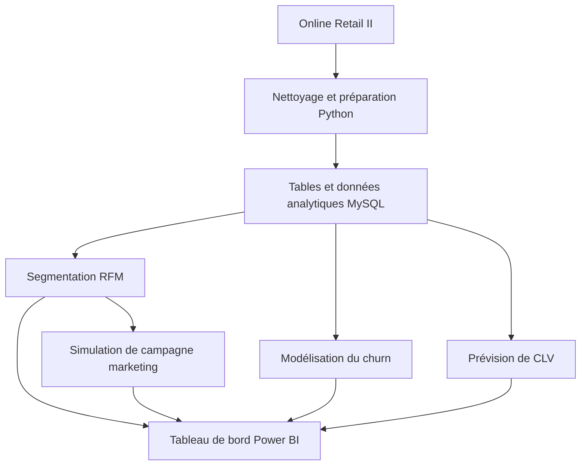

# 🎯 Customer Intelligence — Analyse du comportement client et prédiction du churn

**Projet personnel | Data Analytics · Machine Learning · Business Intelligence**

🇫🇷 Français | [🇬🇧 English](README_EN.md)

[](https://www.python.org/)
[](https://scikit-learn.org/)
[](https://powerbi.microsoft.com/)
[](https://www.mysql.com/)

## 1. Présentation

Projet d'analyse de données transactionnelles visant à comprendre les comportements d'achat, segmenter les clients, étudier le risque d'attrition (*churn*) et estimer la valeur vie client (*Customer Lifetime Value*, CLV). Le travail couvre la préparation des données, leur structuration sous MySQL, l'analyse statistique, la modélisation et la restitution dans Power BI.

**Jeu de données :** Online Retail II, transactions historiques de 2009 à 2011. Ce dépôt présente un projet de portfolio et non une solution déployée en production.

| Indicateur | Valeur rapportée dans le projet |
|---|---:|
| Transactions brutes | 1 067 371 |
| Transactions nettoyées | 779 425 |
| Clients uniques | 5 878 |
| Chiffre d'affaires historique analysé | 17 374 804,27 £ |
| Segments RFM | 11 |
| Modèles de classification comparés | 4 |
| Pages Power BI documentées | 8 |

> Les chiffres ci-dessus proviennent des résultats consignés dans la documentation du projet. Les prédictions de churn et de CLV sont des sorties de modèles ; les résultats de campagne marketing sont simulés, et non des effets commerciaux observés.

## 2. Aperçu du tableau de bord Power BI

### Vue exécutive


### Analyse des clients


Le tableau de bord est décrit dans la documentation comme comprenant huit pages : vue exécutive, segmentation, risque de churn, prévision de CLV, tendances temporelles, produits, géographie et simulation marketing.

[Ouvrir le fichier Power BI](powerbi/Customer%20Intelligence%20Dashboard.pbix)

## 3. Objectifs et livrables

| Domaine | Méthode | Livrable |
|---|---|---|
| Préparation | Python, Pandas, NumPy | Transactions nettoyées et variables dérivées |
| Modélisation des données | MySQL | Tables transactionnelles et analytiques |
| Segmentation | Scores RFM | 11 segments clients |
| Churn | Classification supervisée | Scores de risque et évaluation des modèles |
| CLV | BG/NBD et Gamma-Gamma | Prévisions à 12 mois |
| Expérimentation | Simulation, tests statistiques | Scénario de campagne et ROI projeté |
| Restitution | Power BI | Tableau de bord interactif |

## 4. Architecture



## 5. Analyses et résultats

### 5.1 Préparation des données

**Notebook :** `notebooks/01_data_cleaning.ipynb`

- Entrée : **1 067 371** transactions historiques.
- Traitements documentés : valeurs manquantes, doublons, commandes annulées et création de variables transactionnelles et temporelles.
- Sortie : **779 425** transactions nettoyées.

### 5.2 Segmentation RFM

**Notebook :** `notebooks/02_rfm_analysis.ipynb`

La méthode RFM repose sur la **récence**, la **fréquence** et le **montant** des achats. Un système de scores par quartiles sert à constituer **11 segments**.

| Résultat documenté | Valeur |
|---|---:|
| Clients « Champions » | 1 821 |
| Part des clients « Champions » | 30,98 % |
| Chiffre d'affaires des « Champions » | 13,19 M£ |
| Part du chiffre d'affaires des « Champions » | 75,89 % |
| Clients « At Risk » | 687 |

Les montants associés aux clients à risque sont des estimations d'exposition, et non des pertes de revenus constatées.

### 5.3 Prédiction du churn

**Notebook :** `notebooks/03_churn_prediction.ipynb`

Le churn est défini dans le projet comme une absence d'achat sur une période de **90 jours**. Les modèles comparés sont la régression logistique, Random Forest, Gradient Boosting et XGBoost.

| Indicateur documenté | Valeur |
|---|---:|
| Clients classés comme inactifs | 3 490 |
| Taux de churn annoncé | 56,60 % |
| Modèle retenu dans le README | Régression logistique |
| ROC-AUC annoncée | 0,7294 |
| Seuil de classification annoncé | 0,10 |
| Clients actifs à haut risque, selon la synthèse | 414 |
| Chiffre d'affaires exposé estimé pour ce groupe | 307 781 £ |

**Interprétation :** la ROC-AUC est la performance annoncée dans le README, pas une validation indépendante du notebook. Les deux versions fournies indiquent des F1-scores différents (**0,7413** et **0,7428**) ; aucun n'est repris comme résultat définitif sans vérification du calcul et de son jeu d'évaluation.

La documentation doit également préciser la fenêtre d'observation, l'horizon de prédiction, la séparation entraînement/test et la prévention des fuites de données avant de qualifier ce modèle de prédictif en conditions réelles.

### 5.4 Valeur vie client — CLV

**Notebook :** `notebooks/04_clv_analysis.ipynb`

Les modèles **BG/NBD** et **Gamma-Gamma** sont utilisés pour estimer la fréquence future et la valeur monétaire des achats.

| Indicateur documenté | Valeur |
|---|---:|
| Horizon | 12 mois |
| Clients avec prévision | 3 626 |
| CLV totale prédite | 6 485 330,27 £ |
| Corrélation rapportée avec une période de validation de 90 jours | 0,783 |

Ces montants sont des **prévisions**, pas des revenus futurs réalisés.

### 5.5 Simulation d'une campagne de réengagement

**Notebook :** `notebooks/05_ab_testing_simulation.ipynb`

Le scénario étudie une réduction hypothétique de **15 %** destinée à **1 446** clients des segments *At Risk*, *About to Sleep*, *Hibernating* et *Lost*. L'analyse documentée mobilise une répartition stratifiée, un test du Chi-deux et un test t de Welch.

| Résultat **simulé** | Valeur |
|---|---:|
| Hausse relative de conversion | 61,2 % |
| Valeur p issue de la simulation | 0,015 |
| ROI projeté | 648,2 % |
| Bénéfice net projeté | 29 636 £ |

**Important :** aucune campagne réelle n'a été évaluée ici. La significativité statistique dépend des hypothèses de simulation ; elle ne démontre pas un effet causal observé ni un ROI atteignable en production. Une expérience randomisée sur données réelles serait nécessaire pour valider le scénario.

## 6. Base de données

Le projet documente **15 tables** de faits, dimensions, synthèses et résultats. Les principales sont :

| Table | Rôle |
|---|---|
| `fact_transactions` | Transactions nettoyées |
| `dim_customer` | Référentiel client et scores RFM |
| `dim_product` | Produits |
| `dim_date` | Dimension temporelle |
| `dim_customer_clv` | Prévisions CLV |
| `dim_customer_risk` | Scores de risque |
| `segment_kpis` | Indicateurs par segment |
| `monthly_segment_revenue` | Chiffre d'affaires mensuel par segment |
| `customer_360_view` | Vue client consolidée |

Les autres tables et leurs volumes sont décrits dans les scripts du dossier `sql/` et les sorties analytiques.

## 7. Technologies

- **Analyse et préparation :** Python, Pandas, NumPy.
- **Machine Learning :** scikit-learn, XGBoost, SHAP.
- **Statistiques :** SciPy, Statsmodels.
- **CLV :** Lifetimes.
- **Base de données :** MySQL, MySQL Workbench.
- **Visualisation :** Power BI, Matplotlib, Seaborn.
- **Développement :** Jupyter Notebook, Git, GitHub.

## 8. Organisation du dépôt

```text
Customer-Intelligence/
├── data/
│   ├── raw/
│   └── processed/
├── notebooks/
│   ├── 01_data_cleaning.ipynb
│   ├── 02_rfm_analysis.ipynb
│   ├── 03_churn_prediction.ipynb
│   ├── 04_clv_analysis.ipynb
│   └── 05_ab_testing_simulation.ipynb
├── sql/
│   ├── 01_create_tables.sql
│   ├── 02_load_data.sql
│   └── 03_kpi_queries.sql
├── models/
├── reports/
├── powerbi/
│   ├── screenshots/
│   └── Customer Intelligence Dashboard.pbix
├── requirements.txt
└── README.md
```

*Arborescence issue de la documentation fournie : vérifier que tous les chemins correspondent aux fichiers effectivement présents dans le dépôt.*

## 9. Installation

### Prérequis

- Python 3.10 ou version compatible avec `requirements.txt`.
- MySQL 8.0 ou version compatible.
- Git et Jupyter Notebook.
- Power BI Desktop pour ouvrir le fichier `.pbix`.

### Cloner le dépôt

```bash
git clone https://github.com/BrokerRecord/Customer-Intelligence.git
cd Customer-Intelligence
python -m venv .venv
```

**Windows — PowerShell :**

```powershell
.\.venv\Scripts\Activate.ps1
```

**Windows — Invite de commandes :**

```cmd
.venv\Scripts\activate.bat
```

**Linux / macOS :**

```bash
source .venv/bin/activate
```

Installer les dépendances :

```bash
pip install -r requirements.txt
```

### Préparer les données

Télécharger [Online Retail II depuis UCI](https://archive.ics.uci.edu/dataset/502/online+retail+ii), puis placer les fichiers dans `data/raw/` en respectant les chemins attendus par le notebook de nettoyage.

### Exécuter les analyses

```bash
jupyter notebook
```

Exécuter les notebooks numérotés de `01` à `05` dans l'ordre, après avoir vérifié leurs dépendances et chemins d'entrée/sortie.

### Configurer MySQL

Les scripts documentés sont :

```text
sql/01_create_tables.sql
sql/02_load_data.sql
sql/03_kpi_queries.sql
```

Créer la base si le premier script ne le fait pas, adapter les paramètres de connexion et les chemins CSV, puis exécuter les scripts selon leurs dépendances. **Le nom de la base et la commande exacte de création doivent être confirmés dans les scripts ; aucun fichier `sql/db.sql` n'est attesté par l'arborescence fournie.**

### Ouvrir Power BI

Ouvrir `powerbi/Customer Intelligence Dashboard.pbix`, configurer les sources de données locales si nécessaire et actualiser le modèle.

## 10. Limites méthodologiques

- **Données historiques :** les comportements observés sur la période 2009–2011 ne représentent pas nécessairement ceux du commerce actuel.
- **Churn :** une définition à 90 jours et une ROC-AUC rapportée ne suffisent pas à établir une capacité de prédiction prospective ; la chronologie des variables et la séparation entraînement/test doivent être auditées.
- **F1-score :** valeur non publiée ici, car les deux versions du README se contredisent.
- **CLV :** prévisions dépendantes des hypothèses des modèles BG/NBD et Gamma-Gamma.
- **A/B testing :** résultats entièrement simulés ; aucune augmentation de conversion ni aucun ROI n'a été constaté en conditions réelles.
- **Déploiement :** le dépôt ne revendique ni application en production ni actualisation des données en temps réel.

## 11. Références

- [Online Retail II — UCI Machine Learning Repository](https://archive.ics.uci.edu/dataset/502/online+retail+ii)
- [Documentation scikit-learn](https://scikit-learn.org/stable/)
- [Documentation MySQL](https://dev.mysql.com/doc/)
- [Documentation Power BI](https://learn.microsoft.com/fr-fr/power-bi/)
- [Documentation Lifetimes](https://lifetimes.readthedocs.io/)

## 12. Licence et contact

Licence MIT **si le fichier `LICENSE` est bien présent dans le dépôt**.

**Awa Mbaye** — [GitHub : BrokerRecord](https://github.com/BrokerRecord)

[Accéder au dépôt Customer Intelligence](https://github.com/BrokerRecord/Customer-Intelligence)
